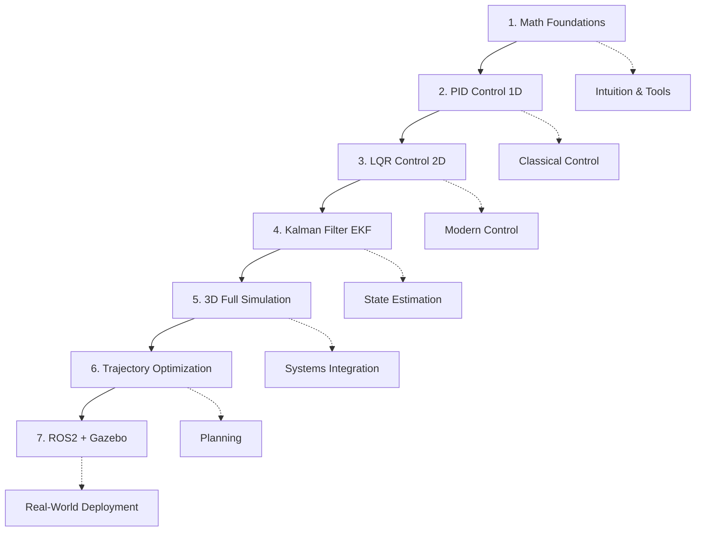

# 🚁 Drone Robotics Learning Roadmap

> *A structured, project-based journey from mathematical foundations to autonomous drone flight — documenting my PhD learning process at the Center for AI and Robotics.*

[](https://github.com/anupamprakash722/drone-robotics-learning-roadmap)
[](https://opensource.org/licenses/MIT)


---

## 📖 About This Repository

This is a **meta-repository** — it contains no code itself. Instead, it serves as the **central navigation hub** for my entire drone robotics portfolio.

Each linked project is a self-contained repository that builds upon the previous one, forming a coherent learning arc from raw mathematics to a fully autonomous simulated drone.

**Why this exists:**
- 📂 Provides a single entry point to all my drone robotics work
- 🗺️ Shows the pedagogical sequence and how concepts interconnect
- 🎯 Demonstrates structured, intentional learning to potential collaborators and employers
- 📝 Documents my growth during my PhD at the Center for AI and Robotics

---

## 🗺️ Learning Path Overview



---

## 📁 Projects

| # | Project | Description | Concepts Mastered | Status |
|---|---------|-------------|-------------------|--------|
| 1 | `math-foundations-sandbox` | Interactive Python notebooks exploring 3D transformations, numerical integration, and probability | Linear algebra, ODE solvers, Gaussian distributions, NumPy | 🔄 In Progress |
| 2 | `1d-drone-pid` | Minimal 1D quadcopter altitude simulator with PID control and gain tuning | PID tuning, dynamics simulation, sensor noise, anti-windup | ⏳ Planned |
| 3 | `planar-quadcopter-lqr` | Nonlinear 2D quadcopter stabilized with LQR via symbolic linearization | State-space control, linearization, LQR, SymPy, controllability | ⏳ Planned |
| 4 | `drone-ekf-estimation` | Extended Kalman Filter fusing noisy IMU and GPS for drone state estimation | EKF, sensor fusion, IMU model, bias estimation, NEES | ⏳ Planned |
| 5 | `quadcopter-3d-cascaded` | Full 6-DOF quadcopter with quaternion kinematics and cascaded control | Quaternions, 3D dynamics, cascaded PID, trajectory tracking | ⏳ Planned |
| 6 | `trajectory-optimization` | Minimum-snap trajectory generation via QP with collision avoidance | Quadratic programming, min-snap, potential fields, cvxpy | ⏳ Planned |
| 7 | `ros2-drone-control` | Deploying custom controller in ROS2 Humble with Gazebo SITL | ROS2, Gazebo, offboard control, Docker, launch files | ⏳ Planned |

---

## 🔗 How Concepts Connect

```text
Project 1: Math Sandbox
    ↓ provides tools & intuition
Project 2: 1D PID
    ↓ introduces control concepts
Project 3: 2D LQR
    ↓ introduces modern control & linearization
Project 4: EKF Estimation
    ↓ enables flight with noisy sensors
Project 5: 3D Full Simulation
    ↓ integrates everything into realistic model
Project 6: Trajectory Optimization
    ↓ adds autonomous planning
Project 7: ROS2 + Gazebo
    ↓ transitions to real-world robotics middleware
```

---

## 🛠️ Technology Stack

| Category | Technologies |
|----------|-------------|
| Language | Python 3.8+, C++ (ROS2 nodes) |
| Mathematics | NumPy, SciPy, SymPy |
| Control | python-control, custom implementations |
| Optimization | CVXPY, SciPy optimize |
| Visualization | Matplotlib, Plotly |
| Middleware | ROS2 Humble, Gazebo |
| Containerization | Docker |
| Testing | pytest, unittest |

---

## 🎯 Learning Philosophy

I'm a Computer Science engineer by training (B.Tech + M.Tech in CSE) pursuing a PhD in AI and Robotics with a focus on drones. Mathematics and physics didn't come naturally to me — this roadmap documents my deliberate practice approach:

- **Code first, derive later** — implement concepts computationally to build intuition
- **One concept per project** — avoid cognitive overload
- **Simulate before flying** — master algorithms in Python before touching hardware
- **Document everything** — each repo has detailed READMEs with theory, equations, and results
- **Build in public** — share the journey, not just the destination

---

## 📊 My Research Context

- **PhD Institution:** IIT Mandi
- **Research Center:** Center for AI and Robotics
- **Research Area:** Aerial Robotics / Drone Autonomy
- **Research Focus:** Autonomous navigation in GPS-denied environments using visual-inertial odometry and deep reinforcement learning

---

## 🚀 How to Use This Roadmap

### For Learners
If you're on a similar journey, follow the projects in numbered order. Each repository has:
- 📖 Detailed README with theory
- 💻 Runnable code with clear instructions
- 🧪 Unit tests verifying correctness
- 📓 Jupyter notebooks for exploration

### For Potential Collaborators
Issues and feature requests are welcome on individual project repositories. If you find this roadmap valuable, consider ⭐ starring the repos.

### For Recruiters / Professors
This portfolio demonstrates proficiency in:
- Mathematical modeling of dynamic systems
- Classical and modern control theory
- Probabilistic state estimation
- Trajectory planning and optimization
- Robot Operating System (ROS2)

---

## 📬 Contact

- **GitHub:** https://github.com/anupamprakash722
- **LinkedIn:** www.linkedin.com/in/anupam-prakash-bb51141a4
- **Email:** anupamprakash722@gmail.com, d25161@students.iitmandi.ac.in
- **Google Scholar:** https://scholar.google.com/citations?user=RvkAySMAAAAJ&hl=en

---

## 📄 License

Each linked project has its own license — refer to individual repositories for details.

---

<p align="center">
  <i>Built with ☕ and determination during my PhD journey.</i>
</p>

